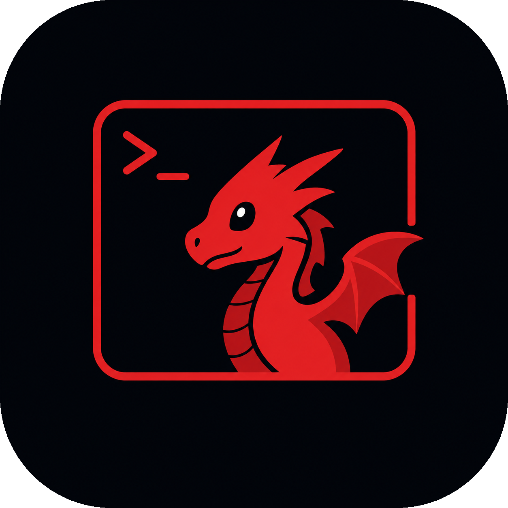

<div align="center">



# dracoshell

**A tiling terminal for Unix, inspired by Hyprland.**

Native GPU rendering · BSP splits · Tabs · 8 built-in themes

</div>

---

## What

`dracoshell` is a single-window terminal emulator with **tiling built in**
— like running Hyprland inside one window. Open new shells with a keystroke,
splits re-tile automatically, and the window stays out of your way.

It's written in Rust, renders on the GPU (`wgpu`), and rasterizes each glyph
exactly once into an atlas — the approach used by `foot`, `ghostty` and
`kitty`. No subpixel positioning, no shape engine, every `P` looks identical
to every other `P`.

The mascot is **Draco** 🐉.

## Features

| | |
|---|---|
| **Tiling** | Split a pane horizontally or vertically; the BSP tree re-balances every pane automatically. |
| **Tabs** | Multiple independent BSP trees, switchable by number, hotkey or mouse click. |
| **GPU rendering** | `wgpu` on Vulkan / Metal / DX12 with a per-cell glyph atlas. Sub-millisecond frames, pixel-perfect text. |
| **Scrollback** | Mouse wheel + `Shift+PageUp/Down` navigate history. A thin Draco-red scrollbar appears while scrolled. |
| **8 built-in themes** | One Dark · Dracula · Tokyo Night · Catppuccin Mocha · Solarized Dark · Gruvbox Dark · Nord · Tomorrow Night. Pick with `dracoshell --themes`. |
| **First-run wizard** | A quick prompt for font size and accent color, saved to a TOML config — runs only the first time. |
| **Self-contained binary** | Logo, font (Hack) and `.desktop` entry are all bundled. |

## Install

```sh
git clone git@github.com:dbuzatto/dracoshell.git
cd dracoshell
./install.sh
```

The install script builds `--release` and drops:

- the binary into `~/.local/bin/`
- the `.desktop` entry into `~/.local/share/applications/`
- the icon into `~/.local/share/icons/hicolor/256x256/apps/`

Alternative installs:

```sh
cargo install --path .      # binary only, to ~/.cargo/bin
cargo run --release         # run from source without installing
```

## Keybindings

### Panes — `Ctrl+Alt + …`

| Key | Action |
|-----|--------|
| `H` | Split right |
| `V` | Split below |
| `← ↑ → ↓` | Move focus |
| `W` | Close focused pane |
| `Q` | Quit dracoshell |

### Tabs — `Ctrl+Shift + …`

| Key | Action |
|-----|--------|
| `T` | New tab |
| `1` … `9` | Switch to tab N |
| `Tab` | Cycle to next tab |
| Click | Switch to tab under cursor |

### Scrollback

| Input | Action |
|-------|--------|
| Mouse wheel | Scroll focused pane |
| `Shift + PageUp` / `PageDown` | Page through history |

## Configuration

Config file: `~/.config/dracoshell/config.toml`

```toml
[window]
width = 1200
height = 750

[font]
family = "Hack"
size = 14.0

[colors]
theme = "one-dark"    # any name from `dracoshell --themes`
```

- `dracoshell --setup` regenerates the defaults.
- `dracoshell --themes` opens an interactive picker that updates
  `colors.theme` in-place.

## CLI

```
dracoshell             Launch the terminal
dracoshell --setup     Write default config
dracoshell --themes    Pick a color theme (saved to config)
dracoshell --help      Show all flags and keybindings
dracoshell --version   Show version
```

## Architecture (at a glance)

- **`winit`** for the window and input event loop.
- **`wgpu`** for the render surface (Vulkan on Linux, Metal on macOS).
- **`alacritty_terminal`** for the PTY, VTE parser and grid state.
- **`fontdue`** rasterizes glyphs into a single `R8` atlas texture.
- **Per-cell instanced quads** blit each glyph from the atlas at integer
  cell positions — no shaping, no relayout per frame.
- **BSP layout** owns a binary tree of panes; rects are recomputed on
  resize or split.
- **Tabs** each own an independent BSP tree.

## License

MIT — see [`LICENSE`](LICENSE).

Bundled assets:
- `assets/Hack-Regular.ttf` — Hack font, MIT licensed.
- `assets/dracoshell.png` — Draco logo, this project.
